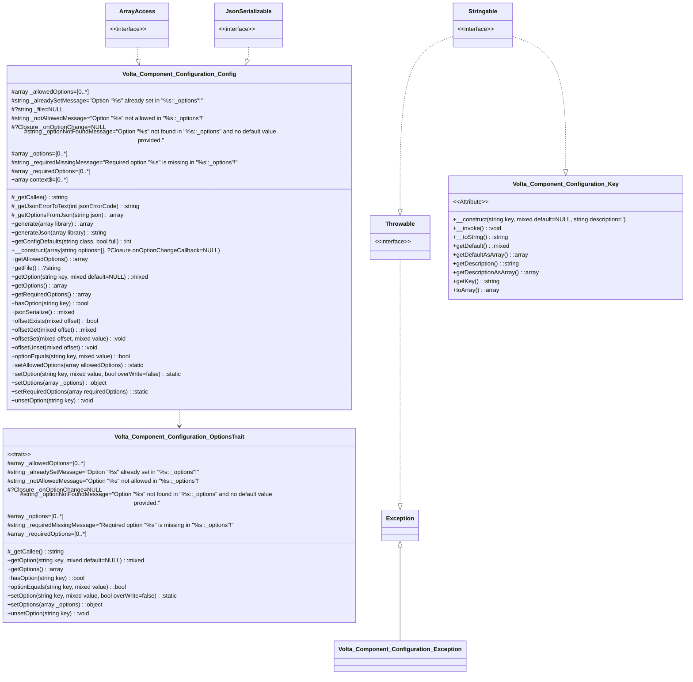

# Volta Configuration

Component to manage configurations

## Usage
Options passing in the constructor can be one of the following:

  1. A PHP file returning an array
  2. A Json file returning valid json
  3. A valid Json string
  4. An array itself

### 1. A PHP file returning an array

`config.php`
```php
declare(strict_types=1);
return [
    'databases' => [
        'default' => [
            'dsn' => 'sqlite:/path/to/sqlite/db/file.sqlite'
        ]
    ]
];
```
`other.php`

```php
declare(strict_types=1);

use Volta\Component\Configuration\Config
use \PDO

$conf = new Config('./config.php');
$pdo = new PDO($conf['databases.default.dsn']);

```

### 2. A Json file returning valid json

`config.json`
```json
{
  "databases": {
    "default": {
      "dsn": "sqlite:/path/to/sqlite/db/file.sqlite"
    }
  }
}
```
`other.php`

```php
declare(strict_types=1);

use Volta\Component\Configuration\Config
use \PDO

$conf = new Config('./config.json');
$pdo = new PDO($conf['databases.default.dsn']);

```

[//]: # (Start Volta\UmlDoc\MermaidDiagram)

[//]: # (End Volta\UmlDoc\MermaidDiagram)
[//]: # (Start Volta\UmlDoc\MdDiagram)

Generated @  20230619 13:50:49

# Volta\Component\Configuration\
3 Classes, 0 Interfaces, 1 Traits, 0 Enums,
### [Volta\Component\Configuration\Config](#) *implements* ArrayAccess, JsonSerializable
 Class Config
 Class for storing name value pairs
#### Properties(10)
- protected array **[_allowedOptions](#)** = [0..*]
- protected string **[_alreadySetMessage](#)** = "Option "%s" already set in "%s::_options"!"
- protected ?string **[_file](#)** = NULL
- protected string **[_notAllowedMessage](#)** = "Option "%s" not allowed in "%s::_options"!"
- protected ?Closure **[_onOptionChange](#)** = NULL
- protected string **[_optionNotFoundMessage](#)** = "Option "%s" not found in "%s::_options" and no default value provided."
- protected array **[_options](#)** = [0..*]
- protected string **[_requiredMissingMessage](#)** = "Required option "%s" is missing in "%s::_options"!"
- protected array **[_requiredOptions](#)** = [0..*]
- public static array **[context](#)** = [0..*]
#### Methods(24)
- protected function **[_getCallee](#)()**: string
- protected function **[_getJsonErrorToText](#)(int jsonErrorCode)**: string
- protected function **[_getOptionsFromJson](#)(string json)**: array
- public static function **[generate](#)(array library)**: array\
&rdsh; *Generates a configuration file based on the Key attributes found in the classes in the libraries*
- public static function **[generateJson](#)(array library)**: string
- public static function **[getConfigDefaults](#)(string class, bool full)**: int
- public function **[__construct](#)(array|string options=[], ?Closure onOptionChangeCallback=NULL)**: \
&rdsh; *Config constructor.*\
&nbsp;&nbsp; *Passed options can be*\
&nbsp;&nbsp; *1. A PHP file returning an array*\
&nbsp;&nbsp; *2. A Json file returning valid json*\
&nbsp;&nbsp; *3. A valid Json string*\
&nbsp;&nbsp; *4. An array itself*
- public function **[getAllowedOptions](#)()**: array
- public function **[getFile](#)()**: ?string
- public function **[getOption](#)(string key, mixed default=NULL)**: mixed\
&rdsh; *Gets the value for an option.*\
&nbsp;&nbsp; \
&nbsp;&nbsp; *If a no option is found with the key __$key__ and a default is provided*\
&nbsp;&nbsp; *the default value is returned. An exception is thrown otherwise.*
- public function **[getOptions](#)()**: array
- public function **[getRequiredOptions](#)()**: array
- public function **[hasOption](#)(string key)**: bool\
&rdsh; *Checks if an option exists.*
- public function **[jsonSerialize](#)()**: mixed
- public function **[offsetExists](#)(mixed offset)**: bool
- public function **[offsetGet](#)(mixed offset)**: mixed
- public function **[offsetSet](#)(mixed offset, mixed value)**: void
- public function **[offsetUnset](#)(mixed offset)**: void
- public function **[optionEquals](#)(string key, mixed value)**: bool\
&rdsh; *Checks whether an _options equal the given value*\
&nbsp;&nbsp; \
&nbsp;&nbsp; *Returns _TRUE_ when option with index __$key__ is set and is of the same value*\
&nbsp;&nbsp; *as __$value__, _FALSE_ otherwise.*
- public function **[setAllowedOptions](#)(array allowedOptions)**: static
- public function **[setOption](#)(string key, mixed value, bool overWrite=false)**: static\
&rdsh; *Sets one option*\
&nbsp;&nbsp; \
&nbsp;&nbsp; *Throws an exception when the option already is set and __$overWrite__*\
&nbsp;&nbsp; *is set to false*\
&nbsp;&nbsp; \
&nbsp;&nbsp; *The __Options::$_requiredOptions__ and __Options::$_allowedOptions__*\
&nbsp;&nbsp; *will be taken into account.*
- public function **[setOptions](#)(array _options)**: object\
&rdsh; *Sets or overwrites the entire _options list.*\
&nbsp;&nbsp; \
&nbsp;&nbsp; *The __Options::$_requiredOptions__ and __Options::$_allowedOptions__*\
&nbsp;&nbsp; *will be taken into account.*
- public function **[setRequiredOptions](#)(array requiredOptions)**: static
- public function **[unsetOption](#)(string key)**: void
### [Volta\Component\Configuration\Exception](#) : Exception *implements* Throwable, Stringable
 The base Exception class for the Volta\Component\Configuration namespace
### [Volta\Component\Configuration\Key](#) *implements* Stringable
#### Methods(9)
- public function **[__construct](#)(string key, mixed default=NULL, string description=")**:
- public function **[__invoke](#)()**: void
- public function **[__toString](#)()**: string
- public function **[getDefault](#)()**: mixed
- public function **[getDefaultAsArray](#)()**: array
- public function **[getDescription](#)()**: string
- public function **[getDescriptionAsArray](#)()**: array
- public function **[getKey](#)()**: string
- public function **[toArray](#)()**: array
<<Trait>> Volta\Component\Configuration\OptionsTrait
#_allowedOptions:array=[0..*]
#_alreadySetMessage:string="Option "%s" already set in "%s::_options"!"
#_notAllowedMessage:string="Option "%s" not allowed in "%s::_options"!"
#_onOptionChange:?Closure=NULL
#_optionNotFoundMessage:string="Option "%s" not found in "%s::_options" and no default value provided."
#_options:array=[0..*]
#_requiredMissingMessage:string="Required option "%s" is missing in "%s::_options"!"
#_requiredOptions:array=[0..*]
#_getCallee():string
+getOption(string key, mixed default=NULL):mixed
+getOptions():array
+hasOption(string key):bool
+optionEquals(string key, mixed value):bool
+setOption(string key, mixed value, bool overWrite=false):static
+setOptions(array _options):object
+unsetOption(string key):void


[//]: # (End Volta\UmlDoc\MdDiagram)
