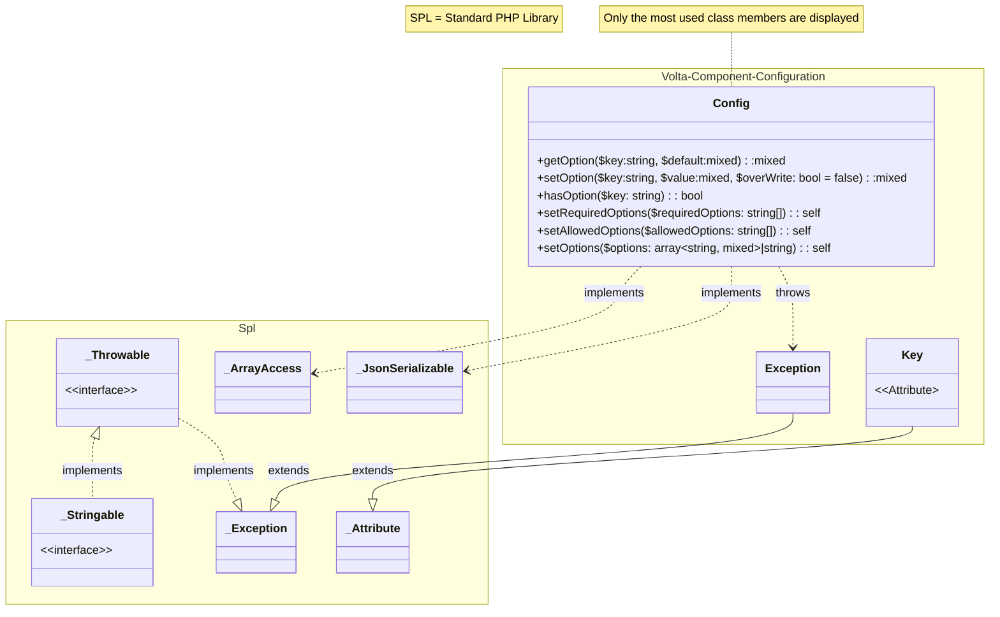

# Volta Configuration Component 

<!-- TOC -->
* [Volta Configuration Component](#volta-configuration-component-)
  * [Features](#features)
  * [UML Class Diagram](#uml-class-diagram)
  * [Construction](#construction)
  * [Usage](#usage)
<!-- TOC -->

Component to manage configurations.
## Features

* Different formats: JSON and PHP Array's
* File or memory storage
* Cascading Configurations
* Specify required options
* Specify a set of allowed options (whitelisting)
* Generation of configuration file(*.json or *.php) based on Configuration Keys Attribute in code

## UML Class Diagram


<small>* *Only the most used class members are displayed in the UML ClassDiagram* </small>\
<small>* *SPL = Standard PHP Library* </small>

## Construction

```php
    declare(strict_types=1);
    
    use Volta\Component\Configuration\Config
    
    // i. Initialize a Config object with options stored in a *.php file 
    $conf = new Config(__DIR__ . '/config/example-config.php');
    
    // ii. Initialize a Config object with options stored in a *.json file 
    $conf = new Config(__DIR__ . '/config/example-config.json');
    
    // iii. Initialize a Config object with options stored in a json string 
    $conf = new Config(
       '{
           "databases": {
             "default": {
               "dsn": "sqlite:/path/to/sqlite/db/file.sqlite"
             }
           }
       }'
    );
    
    // iv. Initialize a Config object with options stored in a php array 
    $conf = new Config(
       [
          'databases' => [
              'default' => [
                  'dsn' => 'sqlite:/path/to/sqlite/db/file.sqlite'
              ]
          ]
      ]
    );
    
    // v. Adding or overwriting data after initialization can be done with the setOption() method
    //    and accepts all the formats described above. Previous data will be
    //    overwritten. (cascading) configuration 
    $conf->setOptions(__DIR__ . '/config/example-config.php')
    
```
File : `~/config/example-config.php`:
```php
declare(strict_types=1);

return [
    'databases' => [
        'default' => [
            'dsn' => 'sqlite:/path/to/sqlite/db/file.sqlite'
        ]
    ]
];
```

File: `~/config/example-config.json`:
```json
{
  "databases": {
    "default": {
      "dsn": "sqlite:/path/to/sqlite/db/file.sqlite"
    }
  }
}
```


## Usage

When the Configuration object is initialized values can be retrieved. Best to show with some example code:

```php
declare(strict_types=1);

use Volta\Component\Configuration\Config
use Volta\Component\Configuration\Exception as ConfigException
use \PDO

$conf = new Config(__DIR__ . '/config/example-config.php');

// check if we have a database configuration, exit if not 
if ($conf->hasOption('databases.default')) {
   exit('No default database settings configured')
}

// The above functionality can also be accomplished by adding (a) required option(s) which 
// will generate an exception on failure with the message:
//
//     Required option "databases.default" is missing
//
try{
    $conf = new Config(
        options: __DIR__ . '/config/example-config.php', 
        requiredOptions: ['databases.default']
    );
} catch (ConfigException $e) {
    exit($e->getMessage())
}    


// We also can set/overwrite a value
$conf->setOption(
    key: 'database.default.password', 
    value: null,
    overWrite: true 
);

// create PDO object and provide some defaults in case some options are not set
$pdo = new PDO(
    dns: $conf['databases.default.dsn'],
    username: $conf->getOption('databases.default.username', null),
    password: $conf->getOption('databases.default.password'),
    options: $conf->getOption(
        'databases.default.options', 
        [
            PDO::ATTR_EMULATE_PREPARES => false,
            PDO::ATTR_ERRMODE => PDO::ERRMODE_EXCEPTION,
            PDO::ATTR_DEFAULT_FETCH_MODE => PDO::FETCH_ASSOC,
            PDO::ATTR_CASE => PDO::CASE_NATURAL
        ]        
    )
);
```