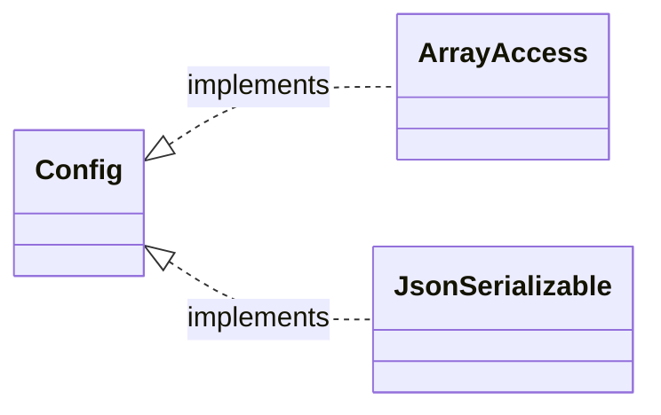
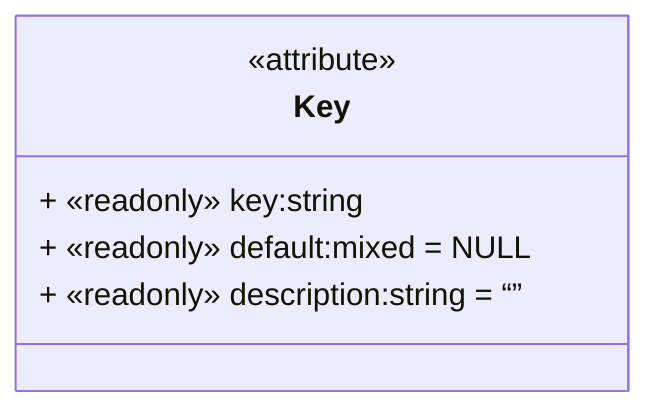
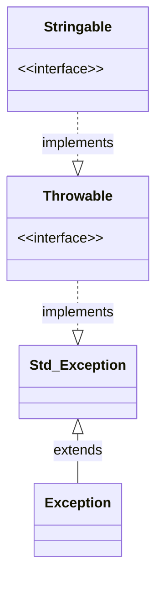

# Library

The Configuration component counts 3 classes all in the namespace *Volta\Component\Configuration*:

1. Volta\Component\Configuration\Config
2. Volta\Component\Configuration\Key
3. Volta\Component\Configuration\Exception

## ~\Config

## ~\Key

## ~\Exception

Basic Exception for all exceptions thrown in this Component.

