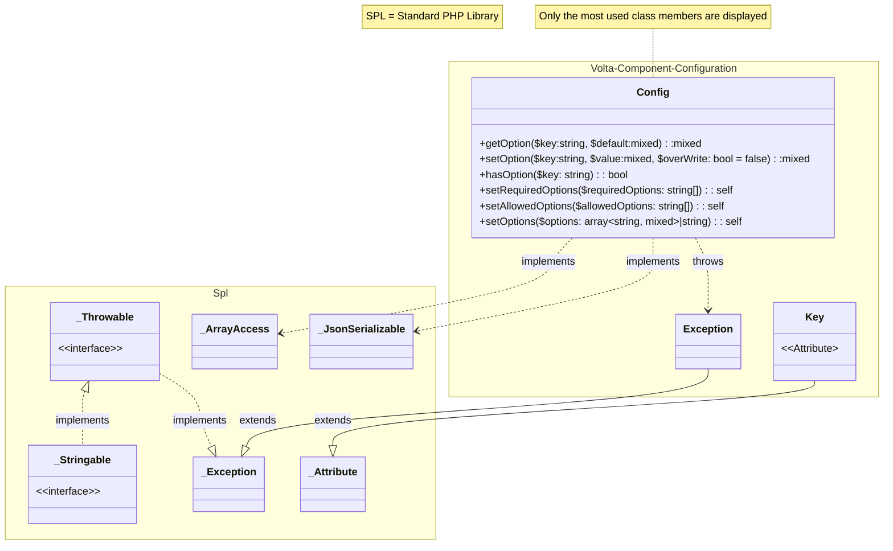

# Library

The Configuration component counts 3 classes all in the namespace *Volta\Component\Configuration*:

1. Volta\Component\Configuration\Config
2. Volta\Component\Configuration\Key
3. Volta\Component\Configuration\Exception

## UML Class Diagram

<small>* *Only the most used class members are displayed in the UML ClassDiagram* </small>\
<small>* *SPL = Standard PHP Library* </small>